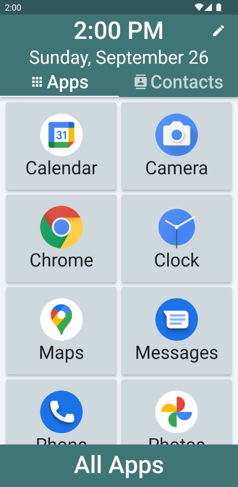
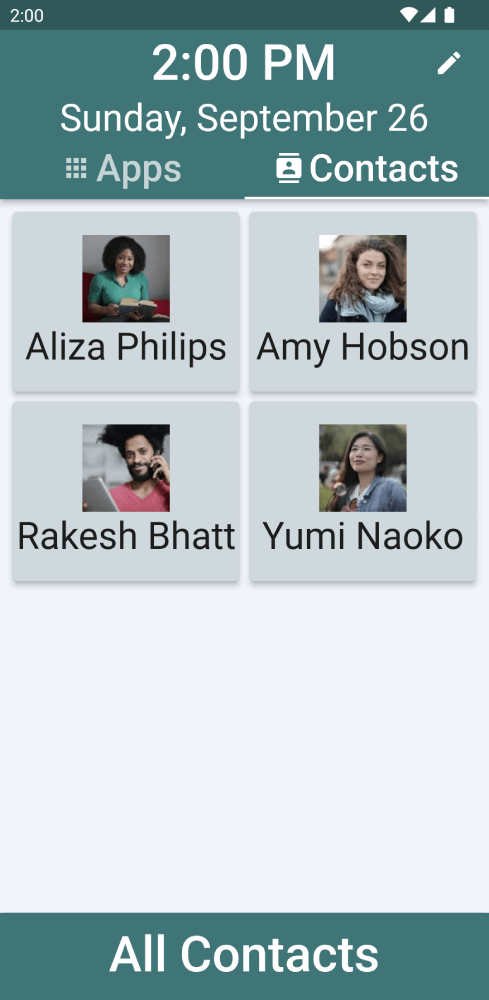
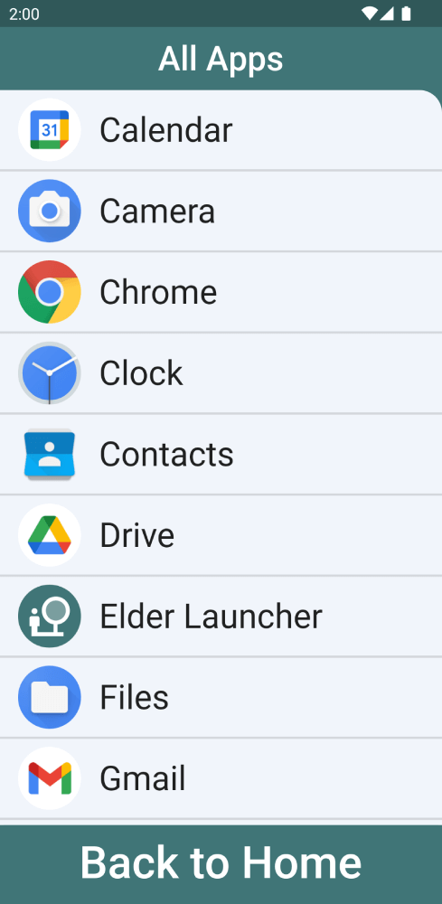
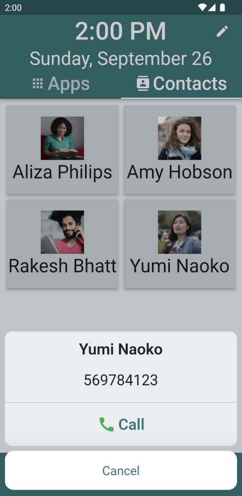
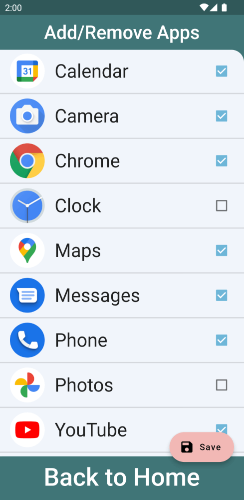
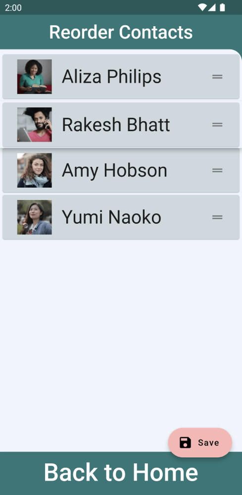
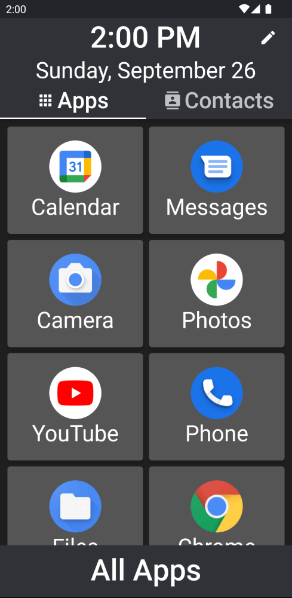
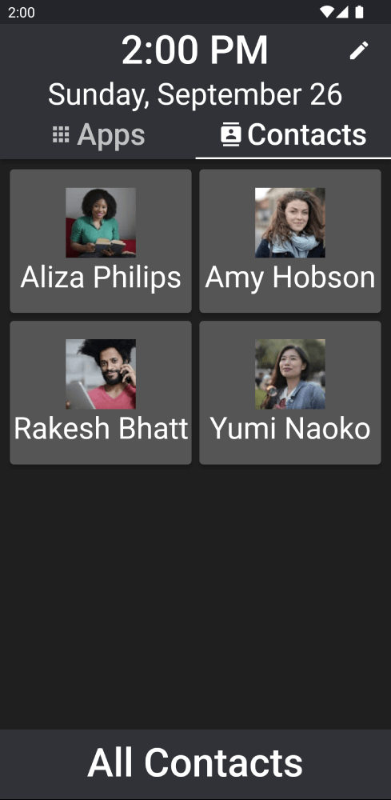
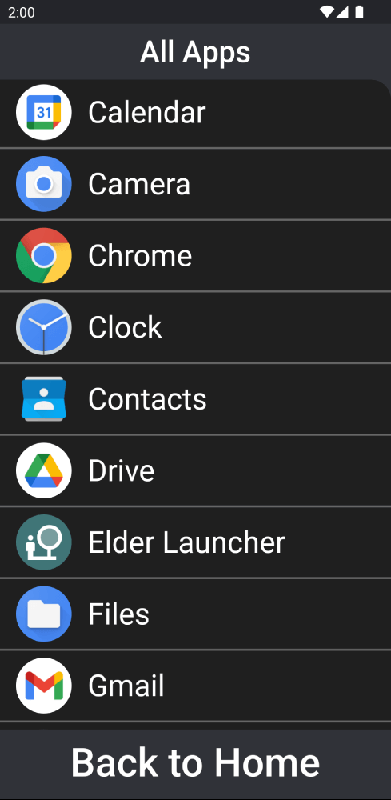

# Elder Launcher

Elder Launcher is a launcher designed for seniors focused on simplicity and legibility.

Elder Launcher supports pinning favorite apps and contacts to the homescreen for quick access.

## Install

 

Also available from [GitHub Releases](https://github.com/itsarjunsinh/elder_launcher/releases)

## Tech

Elder Launcher is developed using [Flutter](flutter.dev).

The app relies heavily on the following open source Flutter packages:

* [contact_service](https://pub.dev/packages/contacts_service) - For accessing contacts
* [device_apps](https://pub.dev/packages/device_apps) - For accessing apps

> Install __Flutter Intl plugin__ ([VS Code](https://marketplace.visualstudio.com/items?itemName=localizely.flutter-intl), [InteliJ](https://plugins.jetbrains.com/plugin/13666-flutter-intl)) for generating localisation files. Your IDE might show errors and warnings if this is not installed.

## More Screenshots

 

### Dark mode (Android 10+)
Can be enabled from system settings

## License

This project is licensed under the [MIT License](LICENSE.md). 
